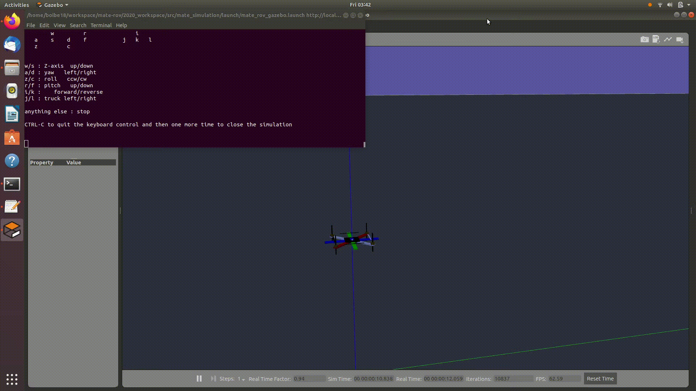

# MATE ROV LAUNCH INSTRUCTIONS



* Note : this simulation is currently heavily inspired from https://github.com/NishanthARao/ROS-Quadcopter-Simulation , it's a very nice simulation base so please see how the simulation started at your own leisure. 

These are our first Launch instructions and they may change but it'll help you get the ROV to move.

```
cd ~/workspace/mate-rov/2020_workspace
catkin_make
source devel/setup.bash
roslaunch mate_simulation mate_rov_gazebo.launch
```
Make sure you click the terminal you just launched when you want to use the keyboard to control the ROV.

You should now be able to control the ROV :) enjoy


* WARNING : WE DO NOT HAVE ANY LIMITS ON THE PROPELLOR VALUES, press and let the buttons go to avoid sending an absurdly high signal to the propellors. 

```
Moving around:
        w         r               i         
   a    s    d    f           j   k   l
   z         c


w/s : Z-axis  up/down 
a/d : yaw   left/right
z/c : roll   ccw/cw
r/f : pitch   up/down
i/k :    forward/reverse
j/l : truck left/right 

anything else : stop

CTRL-C to quit the keyboard control and then one more time to close the simulation
```

### GIT WARNING
DO NOT ADD the "build" and "devel" directories upon commits.
thus NEVER do 
```git add .```
